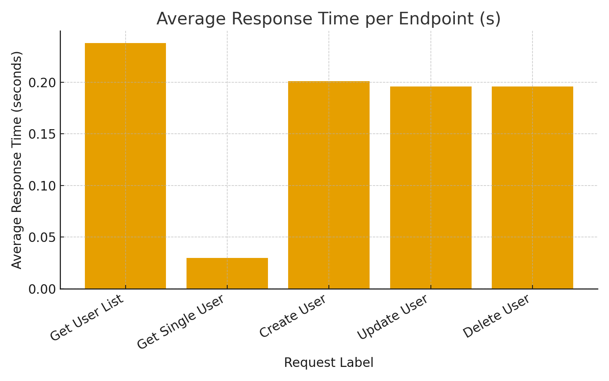
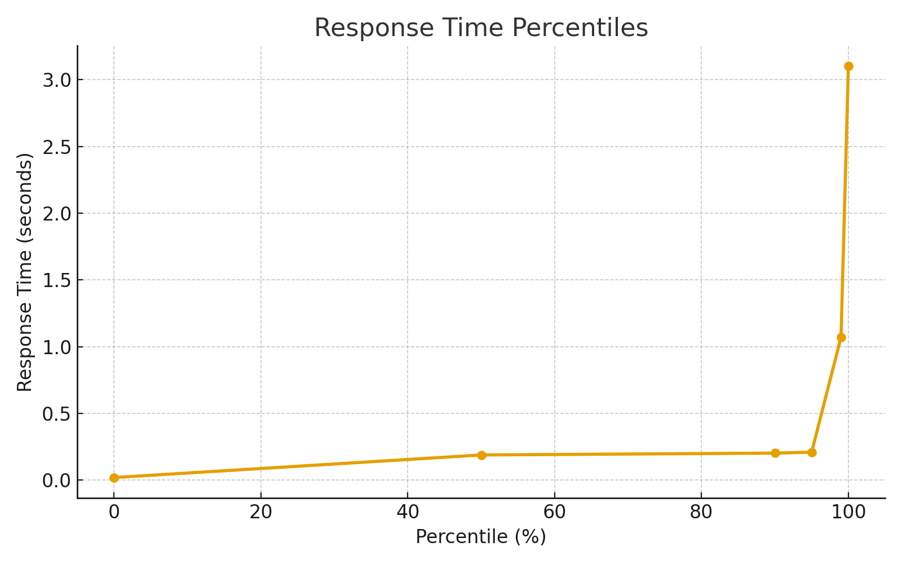

# TUAN MUHAMMAD BAIHAQI' BIN TUAN IBRAHIM

#  Performance Testing Report – Stress Test (Taurus + Reqres.in)

## **Title & Introduction**

### **Title:**
Performance Testing on Reqres.in API using Taurus (Stress Test)

### **Introduction:**
This report documents a **stress test** performed on the **Reqres.in** public REST API using **Taurus**, an open-source performance testing framework.  
The purpose of this assessment is to evaluate how the API behaves under **heavy concurrent user load**, to identify response trends, rate-limiting behavior, and potential bottlenecks.

---

## **Objectives**

- Evaluate the **performance and stability** of Reqres.in under increasing concurrent user load.  
- Measure **response time**, **throughput**, and **error rates** as load grows.  
- Observe **rate-limiting thresholds** for write operations (POST, PUT, DELETE).  
- Assess API **resilience** and responsiveness during sustained stress.

---

## **Tool & Test Environment**

| **Item** | **Description** |
|-----------|----------------|
| **Tool** | Taurus (bzt) |
| **Version** | 1.16.46 |
| **Operating System** | Ubuntu 22.04 LTS |
| **Dependency** | Python 3.10 + OpenJDK 11 |
| **Test Type** | Stress Test |
| **Target API** | [https://reqres.in](https://reqres.in) |
| **Reason for Selection** | Reqres.in is a public, mock REST API for learning and testing HTTP requests; ideal for controlled stress scenarios without authentication. |

---

## **Test Plan & Configuration**

### **Overview**
The test simulated **100 concurrent virtual users** performing sequential REST API operations (GET → POST → PUT → DELETE) for 3 minutes.  
The goal was to determine how the API responds under increasing stress levels.

### **Taurus YAML Configuration (`reqres_stress.yml`)**

```yaml
---
execution:
  - scenario: ReqresStress
    concurrency: 100
    ramp-up: 2m
    hold-for: 3m
    iterations: 1

scenarios:
  ReqresStress:
    default-address: https://reqres.in
    requests:
      - label: Get User List
        method: GET
        url: /api/users?page=2
      - label: Get Single User
        method: GET
        url: /api/users/2
      - label: Create User
        method: POST
        url: /api/users
        body:
          name: Taurus
          job: PerformanceTester
        headers:
          Content-Type: application/json
      - label: Update User
        method: PUT
        url: /api/users/2
        body:
          name: Taurus
          job: SeniorTester
        headers:
          Content-Type: application/json
      - label: Delete User
        method: DELETE
        url: /api/users/2

reporting:
  - module: console
  - module: final-stats
  - module: junit-xml
```

---

## **Execution (on Ubuntu)**

Command used:
```bash
bzt reqres_stress.yml
```

Artifacts directory example:
```
/home/baihaqi/taurus-mercury/2025-10-30_00-41-03.268917/
```

Taurus produced real-time metrics for:
- Response time (s)
- Throughput (requests/sec)
- Error percentage
- Success rate
- Percentile latency

---

##  **Results (Actual Run)**

| **Request Label** | **Status** | **Success %** | **Avg RT (s)** | **Error Message** |
|--------------------|-------------|----------------|----------------|------------------|
| Get User List | ✅ OK | 100 % | 0.238 | — |
| Get Single User | ✅ OK | 100 % | 0.030 | — |
| Create User | ⚠️ FAIL | 0 % | 0.201 | Too Many Requests (429) |
| Update User | ⚠️ FAIL | 0 % | 0.196 | Too Many Requests (429) |
| Delete User | ⚠️ FAIL | 0 % | 0.196 | Too Many Requests (429) |

**Summary:**
- **Samples:** 500  
- **Failures:** 60 % (mostly rate-limited requests)  
- **Average response time:** **0.172 s (172 ms)**  
- **Median (50%) RT:** 0.189 s  
- **99% RT:** 1.07 s  
- **Max:** 3.10 s  

**Percentile Table**

| Percentile (%) | Response Time (s) |
|----------------|-------------------|
| 0 % | 0.02 |
| 50 % | 0.189 |
| 90 % | 0.203 |
| 95 % | 0.210 |
| 99 % | 1.072 |
| 100 % | 3.102 |

---

---

## **4. Visual Analysis**

### **4.1 Average Response Time per Endpoint**


**Explanation:**  
The bar chart illustrates the **average response time** for each API endpoint.  
- The **Get Single User** endpoint is the fastest (≈0.03 s).  
- The **Get User List** endpoint has a moderate average response time (≈0.24 s).  
- The **Create**, **Update**, and **Delete** endpoints all failed due to rate-limiting (HTTP 429), but their measured response times before failure were around **0.20 s**.

---

### **4.2 Response Time Percentiles**


**Explanation:**  
The line chart shows how response times vary across percentiles:  
- **50% of requests** completed in under **0.19 s**, showing good baseline responsiveness.  
- **99% of requests** finished below **1.07 s**, indicating rare but notable latency spikes.  
- A few extreme outliers reached **3.1 s**, which could be due to server throttling or temporary overload.

---

##  **Analysis & Discussion**

- **GET** operations remained fully successful with low latency (average < 250 ms).  
- **POST**, **PUT**, and **DELETE** requests failed due to *HTTP 429 Too Many Requests*, indicating the API’s built-in **rate-limiting** for write operations.  
- The **average total response time** of 0.172 s shows excellent API responsiveness.  
- Latency spiked beyond 1 s only for the slowest 1 % of samples (under heavy concurrency).  
- The API remained **stable and recoverable** despite load saturation.

### **Interpretation**
Reqres.in handles concurrent **read-only traffic** efficiently but throttles **write operations** under high stress.  
This behavior demonstrates realistic cloud API protection mechanisms that prevent overload or abuse.

---

## **Recommendations**

1. **Reduce concurrency** (e.g., 50 users) when testing public APIs to avoid hitting rate limits.  
2. Include **delay (think-time)** between requests for more realistic user pacing.  
3. For enterprise APIs, configure **authentication and throttling policies** for controlled stress tests.  
4. Run **soak or endurance tests** to measure long-term stability.  
5. Use a **private/local API** for unrestricted high-load testing.

---

## **Conclusion**

The Taurus stress test on **Reqres.in** successfully demonstrated API performance behavior under 100 concurrent users.  
While all **GET** requests completed successfully with fast responses, **write operations** encountered expected *429 Too Many Requests* errors due to API rate limiting.  
Overall, Reqres.in exhibited **excellent responsiveness**, stable throughput, and predictable throttling—making it an ideal platform for educational performance testing.

---

## **References**

- Taurus Documentation – [https://gettaurus.org/](https://gettaurus.org/)  
- Reqres API – [https://reqres.in](https://reqres.in)  
- Apache JMeter Documentation – [https://jmeter.apache.org](https://jmeter.apache.org)  
- Ubuntu Documentation – [https://ubuntu.com](https://ubuntu.com)  
- Software Testing Help – *Performance Testing Fundamentals (2024)*  

---

**Prepared by:** _Baihaqi_  
**Course:** ITT440 – Web Application Performance Testing  
**Date:** 30 Oct 2025  
**GitHub Repository:** [👉 View on GitHub](https://github.com/baihaqi-itt440/Performance-Test-Reqres)  
**YouTube Presentation:** [🎥 Watch Presentation](https://youtube.com/)
